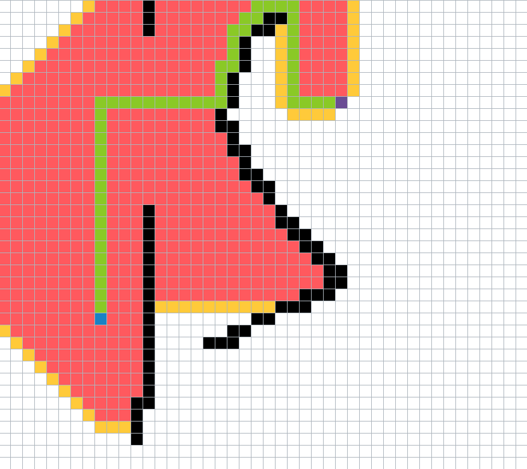

# Pathfinder

* Blue cell = Start
* Purple cell = End
* Green cells = Path
* Yellow cell = Open cell
* Red cell = Closed cell, visited
* Black cell = Wall

## Usage
| Action      | Key               |
|-------------|-------------------|
| Add start   | First left click  |
| Add end     | Second left click |
| Add wall    | Third+ left click |
| Delete wall | Right click       |
| Start       | F                 |
| Reset       | R                 |

